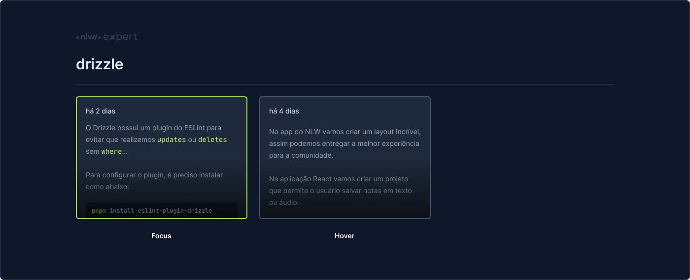
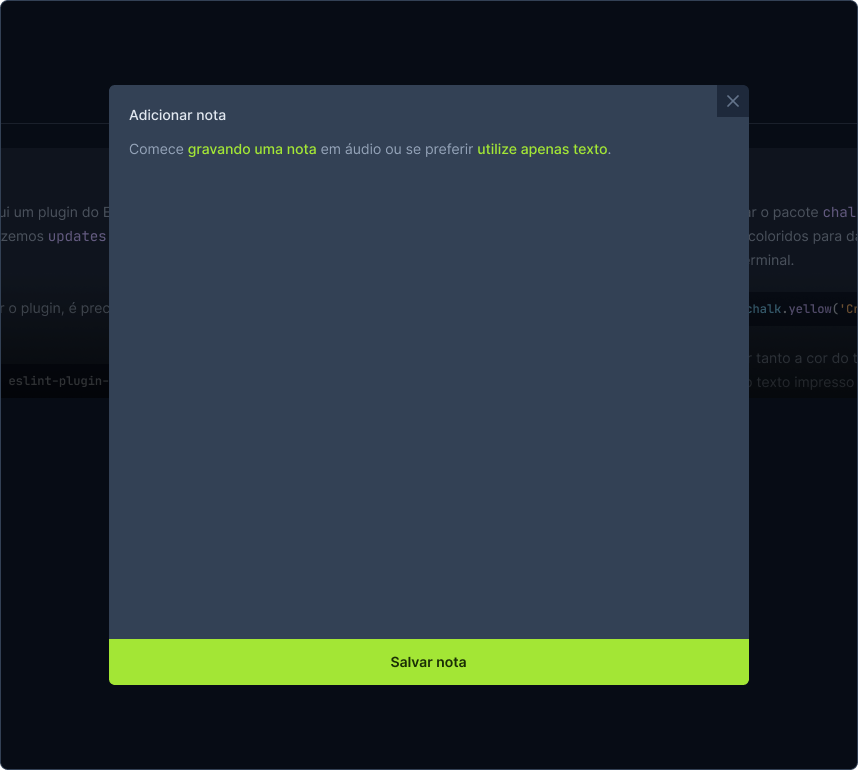
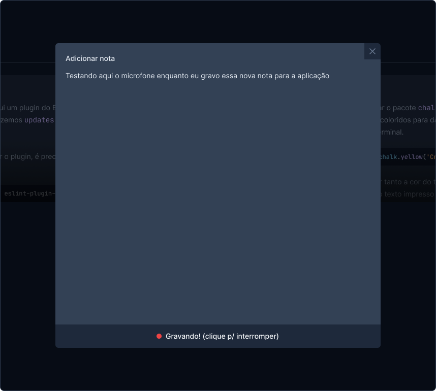
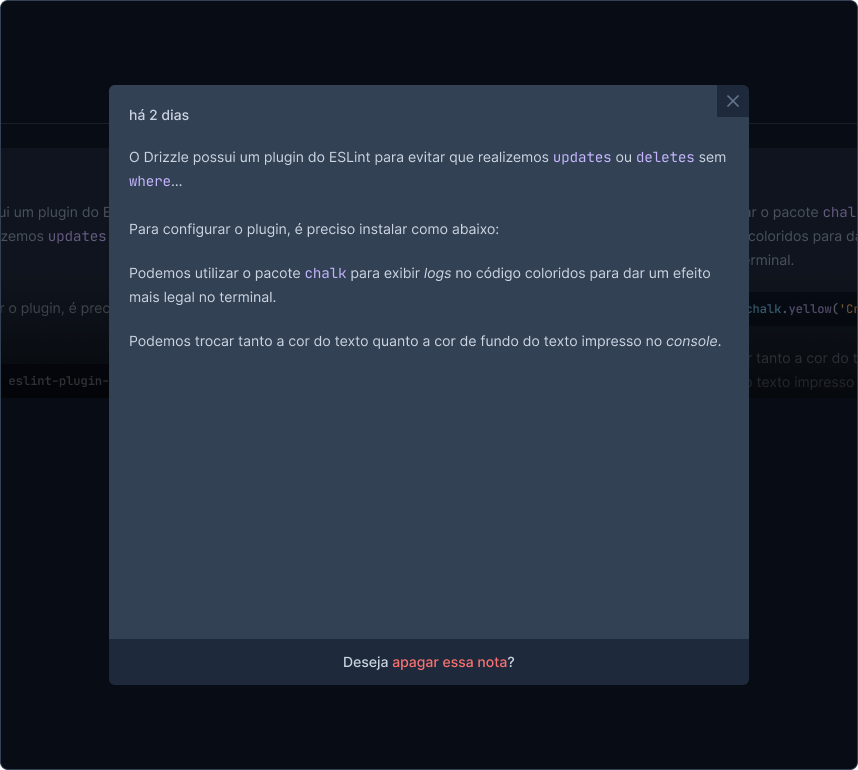

# 🚀 NLW Expert - React App Notes


🔗 **[Acesse o Deploy Online aqui](https://cidvieira.github.io/react-app-notes)**
 

## 💡 Sobre o Projeto

Transforme suas ideias em texto com essa aplicação de notas! 🚀 Além de permitir que você digite suas anotações, esse app também oferece a funcionalidade de transcrição de áudio para texto, utilizando o microfone do seu dispositivo. Grave suas ideias, reuniões ou aulas e deixe que o app faça o resto!

Projeto construído durante o NLW Expert da **Rocketseat** utilizando React, TypeScript, Tailwind e a SpeechRecognition API.


## 🎨 Visualização

<table>
  <tr>
    <td align="center"><strong>Tela Inicial - Adicionar Notas</strong></td>
    <td align="center"><strong>Buscando Notas</strong></td>
  </tr>
  <tr>
    <td></td>
    <td></td>
  </tr>
</table>
<table>
  <tr>
    <td align="center"><strong>Adicionando Nota (Gravar ou Digitar)</strong></td>
    <td align="center"><strong>Gravando Nota</strong></td>
    <td align="center"><strong>Nota</strong></td>
  </tr>
  <tr>
    <td></td>
    <td></td>
    <td></td>
  </tr>
</table>

## 🚀 Tecnologias

- **React 18** - Biblioteca para interfaces de usuário
- **TypeScript** - Superset JavaScript com tipagem estática
- **Vite** - Build tool e servidor de desenvolvimento
- **TailwindCSS** - Framework CSS utility-first
- **Radix UI** - Componentes primitivos acessíveis
- **Sonner** - Criar notificações (os "toasts") em aplicativos web
- **data-fns** - Manipulação de datas
- **Lucide React** - Biblioteca de ícones

## ⚙️ Configuração do Projeto

### Pré-requisitos

- Node.js (versão 18 ou superior)
- npm ou yarn

### Instalação

1. Clone o repositório
2. Instale as dependências:

   ```bash
   npm install
   ```

3. Execute o servidor de desenvolvimento:

   ```bash
   npm run dev
   ```

4. Acesse a aplicação em `http://localhost:5173/react-app-notes`

### Scripts Disponíveis

- `npm run dev` - Inicia o servidor de desenvolvimento
- `npm run build` - Gera build de produção
- `npm run preview` - Preview do build de produção
